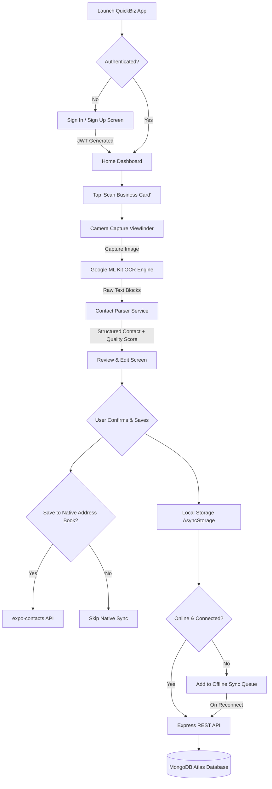
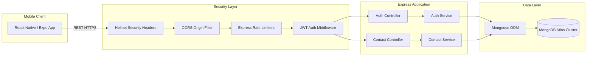

# QuickBiz – Smart Business Card Scanner APP

<p align="center">
  
</p>

<p align="center">
  <strong>An intelligent, offline-first mobile application that transforms physical business cards into structured digital contacts using on-device OCR, multi-field regex parsing, native address book integration, and secure cloud synchronization.</strong>
</p>

<p align="center">
  
  
  
  
  
  
  
  
</p>

---

## 📱 App Screenshots

| 1. Sign In | 2. Home Dashboard | 3. Live Card Scanner | 4. Extracted Review |
|:---:|:---:|:---:|:---:|
| <br/>*User Authentication* | <br/>*Stats & Quick Actions* | <br/>*Camera Alignment Guide* | <br/>*Quality Score & Edit* |

| 5. Contacts Directory | 6. Category Filtering | 7. Contact Profile | 8. Settings & Sync |
|:---:|:---:|:---:|:---:|
| <br/>*Search & Grouping* | <br/>*Clients, Leads, Devs* | <br/>*One-Tap Call & Email* | <br/>*Cloud Sync & Storage* |

> 📷 *For the complete 15-screen inventory and high-resolution capture instructions, see [README_SCREENSHOTS.md](README_SCREENSHOTS.md).*

---

## 🎯 Problem & Solution

### The Real-World Problem
Every day, professionals collect paper business cards at conferences, sales meetings, and networking events. Traditional business card management suffers from critical friction:
- **High Loss Rate**: Paper cards are easily misplaced, damaged, or discarded.
- **Tedious Manual Entry**: Manually typing names, phone numbers, emails, addresses, and job titles into phone address books is slow and error-prone.
- **Duplicate & Fragmented Data**: Repeated contacts create clutter without warning.
- **Zero Searchability**: Physical cards cannot be filtered by category (Client, Investor, Partner) or searched instantly by keywords.

### How QuickBiz Solves It
QuickBiz combines on-device machine learning with structured parsing and cloud synchronization:
1. **Sub-Second On-Device OCR**: Captures business cards with the camera and extracts raw text locally using Google ML Kit (no external API calls or latency).
2. **Deterministic Rule-Based Parser**: Automatically identifies names, job titles, companies, emails, phone numbers, websites, and addresses.
3. **Extraction Quality Scoring**: Calculates a confidence score (0–100%) so users know exactly which fields might need a quick check.
4. **Offline-First Storage**: Saves contacts locally in `AsyncStorage` immediately and queues updates for automatic synchronization when online.
5. **One-Tap Native Contact Sync**: Exports cards directly into the device's native address book via `expo-contacts`.

---

## ✨ Key Features

- 📸 **Camera Card Scanner**: Live camera viewfinder with card alignment frame, flash/torch toggle, camera flip, and capture review.
- ⚡ **On-Device ML Kit OCR**: Native text recognition running locally on the device using Google ML Kit Text Recognition v2 (`expo-mlkit-ocr`). Zero per-scan API cost and privacy-first text extraction.
- 🧠 **Smart Field Parser**: Rule-based categorization extracting:
  - Full Name (filtered against dictionary keywords & company suffixes)
  - Job Title / Designation (checked against 35+ executive & technical titles)
  - Company Name (recognized via legal suffixes and corporate keywords)
  - Multiple Phone Numbers (mobile, office, landline, fax categorization)
  - Multiple Email Addresses (strict RFC-compliant regex validation)
  - Physical / Office Address (street, building, PIN/ZIP code detection)
  - Websites & Portfolio URLs (domain normalization)
- 📊 **Quality Score Badge**: Visual 0–100% extraction quality score highlighting completeness.
- 👥 **Category Grouping**: Tag contacts as `Client`, `Recruiter`, `Investor`, `Developer`, `Business Partner`, `Customer`, `Friend`, or `Other`.
- 🔍 **Instant Text Search**: Live search across contact names, companies, designations, emails, and phone numbers.
- 📱 **Native Phone Contacts Integration**: Export scanned contacts directly into the device's native address book with one tap (`expo-contacts`).
- 🛡️ **Duplicate Collision Warning**: Server-side and client-side duplicate detection flagging matching emails or phones with an optional "Force Save / Overwrite" bypass.
- 🔄 **Offline-First Synchronization**: Fully functional without internet connection. Queues pending creates, updates, and deletes, syncing automatically upon network restoration.
- 🔐 **Secure JWT Authentication**: User accounts with encrypted passwords (`bcryptjs`), stateless JWT session management, and strict user data isolation.

---

## 🔄 Complete Application Flow




## 🏗️ Backend Architecture

The QuickBiz backend is built with a simple, secure, and maintainable Node.js / Express architecture deployed to a cloud hosting environment:



### Backend Responsibilities
- **Stateless Authentication**: Issues HMAC-SHA256 JWT tokens with 30-day expiration.
- **Request Rate Limiting**: Protects authentication endpoints (20 req/15 min) and contact operations (100 req/15 min) against abuse.
- **Strict Data Isolation**: Enforces query-level tenant isolation `{ userId: req.userId }` so users can never read, modify, or delete another user's data.
- **Automatic Cascading Deletions**: Deleting an account (`DELETE /api/auth/account`) automatically wipes all associated contacts from MongoDB.

---

## 📡 Offline-First & Sync Architecture

QuickBiz ensures that network loss never blocks productivity:
1. **Immediate Local Persistence**: Every card scan, edit, or deletion is committed immediately to the device's `AsyncStorage`.
2. **Pending Queue**: Operations that occur while offline receive `syncStatus: 'pending'`.
3. **Automatic Sync on Reconnect**: When network connectivity returns, `syncPendingContacts()` flushes queued creates, updates, and deletes to the server in chronological order.
4. **Login Reconciliation**: Upon logging in on a new device, `handleLoginSync()` merges local guest cards with the user's remote cloud database without creating duplicates.

---

## 🛠️ Technology Stack

| Layer | Technology | Version | Purpose |
|---|---|---|---|
| **Mobile Framework** | React Native | `0.81.5` | Cross-platform mobile foundation |
| **Tooling & Runtime**| Expo SDK | `~54.0.36` | Managed workflow, build tools & native plugins |
| **Language** | TypeScript | `~5.9.2` | End-to-end static type safety |
| **Navigation** | Expo Router | `~6.0.24` | File-based routing & tab navigation |
| **Camera** | `expo-camera` | `~17.0.10` | High-resolution viewfinder & image capture |
| **On-Device OCR** | `expo-mlkit-ocr` | `^0.2.7` | Google ML Kit Text Recognition v2 |
| **Native Contacts** | `expo-contacts` | `~15.0.11` | Device address book sync & export |
| **Local Storage** | `@react-native-async-storage` | `2.2.0` | Offline-first contact persistence |
| **Secure Storage** | `expo-secure-store` | `~15.0.8` | Encrypted JWT token storage on iOS/Android |
| **Haptics** | `expo-haptics` | `~15.0.8` | Tactile feedback on scan and buttons |
| **Backend Runtime** | Node.js | `20.x / 22.x` | High-performance asynchronous backend |
| **Web Server** | Express | `^5.2.1` | REST API routing and middleware |
| **Database ODM** | Mongoose | `^9.9.3` | Schema validation and MongoDB indexing |
| **Cloud Database** | MongoDB Atlas | `v7.0+` | Scalable cloud document database |
| **Authentication** | `jsonwebtoken` + `bcryptjs` | `^9.0` / `^3.0` | Stateless JWT sessions & password hashing |
| **API Security** | `helmet` + `cors` + `rate-limit` | `^8.3` / `^8.6` | HTTP protection, origin policy & anti-DDoS |

---

## 📂 Project Architecture

```
QuickBiz/
├── mobile/                        # Public React Native / Expo Application
│   ├── app/                       # Expo Router file-based screens
│   │   ├── (tabs)/                # Bottom Tab Navigation
│   │   │   ├── index.tsx          # Home Dashboard (Stats & Actions)
│   │   │   ├── scan.tsx           # Camera OCR Scanner
│   │   │   ├── contacts.tsx       # Contact Directory & Search
│   │   │   └── settings.tsx       # Profile, Storage & Sync Settings
│   │   ├── auth.tsx               # Sign In & Sign Up Screen
│   │   ├── contact-details.tsx    # Single Contact Profile & Actions
│   │   ├── review.tsx             # OCR Extraction Review & Edit Form
│   │   ├── onboarding/            # First-run Onboarding Carousel
│   │   └── permissions/           # Camera & Contacts Permission Setup
│   ├── assets/                    # App icons, splash screens & assets
│   ├── components/                # Reusable UI Component System
│   │   └── ui/                    # Editorial Buttons, Badges, Headers, Rows
│   ├── constants/                 # Theme, Mistral AI Palette & Typography
│   ├── services/                  # Business Logic & Core Services
│   │   ├── api.service.ts         # REST API Client & Session Manager
│   │   ├── contact-parser.service.ts # Regex & Keyword Parsing Engine
│   │   ├── contact.store.ts       # Offline-first AsyncStorage & Sync Store
│   │   └── ocr.service.ts         # Google ML Kit OCR Wrapper
│   ├── utils/                     # Normalization helpers & test scenarios
│   ├── app.json                   # Expo configuration & native build plugins
│   ├── eas.json                   # Expo Application Services build profiles
│   └── package.json               # Mobile dependencies and run scripts
├── .github/
│   └── workflows/
│       └── ci.yml                 # Automated CI Pipeline (Lint, Types, Tests)
├── package.json                   # Workspace root package manifest
├── README_SCREENSHOTS.md          # 15-screen UI capture inventory
└── README.md                      # Project documentation
```

> *Note: The `server/` backend directory contains private cloud deployment code and is excluded from the public repository.*

---

## 🚀 Installation & Setup

### Prerequisites
- **Node.js**: `v20.x` or `v22.x LTS` installed ([nodejs.org](https://nodejs.org))
- **Git**: Installed and configured
- **Expo CLI / EAS CLI**: (Optional for cloud builds) `npm install -g eas-cli`
- **Android Studio** (for Android Emulator) or **Xcode** (for iOS Simulator on macOS)

### 1. Clone the Repository
```bash
git clone https://github.com/devisingh2007/QuickBiz-Smart-Business-Card-Scanner-APP.git
cd QuickBiz-Smart-Business-Card-Scanner-APP
```

### 2. Install Dependencies
```bash
# Install mobile dependencies
cd mobile
npm install
```

---

## 🔑 Environment Configuration

Create a `.env` file in the `mobile/` directory:

```env
# URL pointing to your QuickBiz backend REST API
EXPO_PUBLIC_API_URL=https://your-backend-api.onrender.com/api
```

> 💡 *For local development with an Android emulator, use `http://10.0.2.2:5000/api`. For an iOS simulator, use `http://localhost:5000/api`.*

---

## 📱 Running the App

### Expo Go vs. Expo Development Build
- **Expo Go**: Ideal for rapid UI design and testing tab navigation. Because `expo-mlkit-ocr` uses native C++/Java Google ML Kit binaries, OCR in Expo Go falls back to demo mode.
- **Expo Development Build (Recommended)**: Compiles the full native binary with Google ML Kit OCR and hardware camera acceleration.

### Run on Android (Development Build)
```bash
# From workspace root or mobile/ directory:
npm --prefix mobile run android
```

### Run on iOS (macOS only)
```bash
npm --prefix mobile run ios
```

### Run in Expo Go / Web Preview
```bash
npm --prefix mobile run start
```

---


## 🛡️ Security & Privacy

1. **On-Device Data Processing**: Physical business card photos are processed locally on the phone using Google ML Kit. Images are never uploaded to unverified third-party cloud OCR providers.
2. **Strong Password Encryption**: Passwords are salted and hashed using `bcryptjs` with 10 rounds before touching MongoDB.
3. **Stateless JWT Tokens**: Authenticated sessions use cryptographically-signed JWTs stored in hardware-encrypted device storage (`expo-secure-store`).
4. **Strict Tenant Isolation**: All database operations query `{ userId }` matching the verified token payload, preventing horizontal privilege escalation.
5. **Anti-Brute Force Protection**: Express rate limiting restricts repeated login and registration requests to prevent credential stuffing.
6. **Input Sanitization**: Request parameters and payloads are validated with strict regular expressions and whitelist rules.

---

## 🎨 Design System & UI Aesthetics

QuickBiz features a custom **Editorial Design System** inspired by modern design language:

```
Warm Cream Canvas (#FFF8E0) ── Sunset Orange (#FA520F) ── Ink (#1F1F1F) ── Sunshine Yellow (#FFD06A)
```

- **Color Palette**:
  - **Primary**: Sunset Orange (`#FA520F`) for primary actions and active states.
  - **Surfaces**: Warm Cream (`#FFF8E0`, `#FFFAEB`) for cards and background panels.
  - **Typography**: Ink (`#1F1F1F`) for high-contrast, comfortable reading.
  - **Borders**: Hairline Soft (`#EDEDED`) with subtle elevation shadows.
- **Typography Hierarchy**:
  - **Headings & Display**: Editorial Serif (`Georgia` on iOS, `serif` on Android) for distinctive titles.
  - **Body & Controls**: Clean Geometric Sans-Serif (`System` / `sans-serif`) for crisp UI clarity.
- **Components**: Pre-built pill badges, avatar initials with pastel tint backgrounds, tactile buttons, and search inputs.

---

## ⚠️ Known Limitations

- **Image Quality**: OCR accuracy is directly dependent on camera focus, lighting, and absence of severe motion blur.
- **Stylized Fonts**: Extremely decorative or handwritten cursive scripts may require manual correction on the Review screen.
- **Native Binary Requirement**: Running on-device ML Kit OCR requires compiling a native build (`expo run:android` or EAS Build) rather than the standard Expo Go sandbox.

---

## 🔮 Future Roadmap

- [ ] **vCard & CSV Export**: Bulk export of contacts into `.vcf` and `.csv` spreadsheets.
- [ ] **QR Code Scanning**: Instant extraction of digital vCard QR codes on modern business cards.
- [ ] **Multi-Language OCR**: Latin, Devanagari, Japanese, and Chinese character recognition models.
- [ ] **Contact Notes & Tags**: Custom user tags and meeting voice-memo attachments.
- [ ] **NFC Card Sharing**: Tap-to-share digital profile between two QuickBiz devices.

---

## 🎬 Quick Demo Walkthrough

1. **Sign Up**: Launch the app and create an account with your email and password.
2. **Scan**: Tap the **Scan** tab, align a paper business card within the camera frame, and snap a photo.
3. **Review**: The on-device OCR extracts fields in ~500ms. Check the **Quality Score Badge**, edit any fields if desired, and select a Category.
4. **Save**: Tap **Save Contact**. The card is instantly saved locally, synced to your cloud account, and optionally added to your phone's address book.
5. **Search & Connect**: Find contacts instantly via search or category filters, and tap phone or email icons to initiate direct calls or compose messages.

---

## 🤝 Contributing

Contributions are welcome! To contribute:
1. **Fork** the repository.
2. Create a feature branch: `git checkout -b feature/amazing-feature`.
3. Commit your changes: `git commit -m "feat: add amazing feature"`.
4. Push to your branch: `git push origin feature/amazing-feature`.
5. Open a **Pull Request**.

---

## 📄 License

This project is licensed under the **MIT License**. See the [LICENSE](LICENSE) file for details.

---

<p align="center">
  Built with ❤️ for seamless professional networking with <strong>QuickBiz</strong>.
</p>
